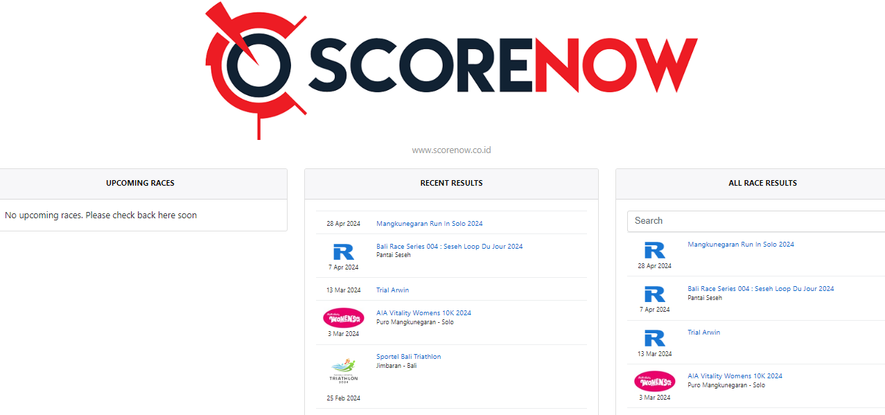

# Race Event Analytics

This repo consists of my personal project to collect and analyze multiple running and other race events collected from [Scorenow](http://results.scorenow.co.id/). All notebooks are written in python with the extension of .qmd or the [Quarto document](https://quarto.org/).

# Phase 1: Web Scraping
The first phase of the project is doing web scrapping to get all the race results from the website using [Selenium](https://selenium-python.readthedocs.io/installation.html). I have collected basic information on 84 events ranging from running events (marathon, half-marathon, 10k), duathlons, triathlons, cycling, etc. 

I have also collected all available race results from those 84 events. Some events have no race results on the website.

